# Docker Setup and Access Instructions

Before proceeding, ensure that your Docker environment is properly configured:

1. **Check Docker Version**  
   Confirm that Docker is installed and running by checking its version:  
   `docker version`

   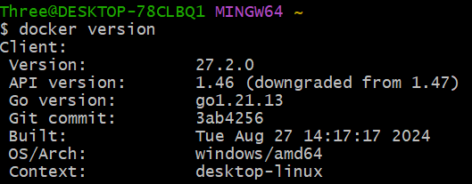

2. **Docker Login (Optional)**  
   If you have a Docker Hub account and need to access private images or avoid rate limits, log in:  
   `docker login`

   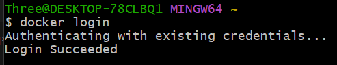

***Note: Refer to previous tutorial to obtain a running Jenkins Docker Container. If you already have a running Jenkins Docker image you can skip these steps***

3. **Pulling and Running the Jenkins Image** –  
   Pull the official Jenkins image from Docker Hub **if necessary**:

   `docker pull jenkins/jenkins:lts`

   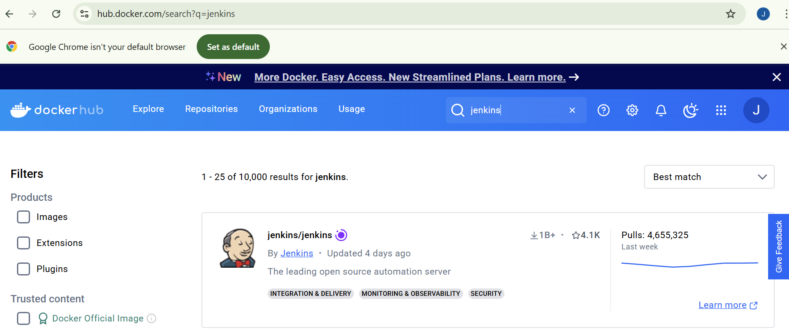 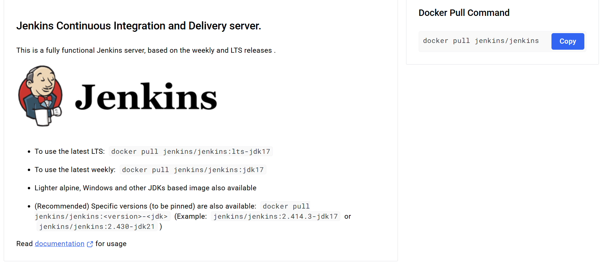

4. **Run the Jenkins Container**  
   With Docker Desktop configured, you can run a Jenkins instance directly from Docker Hub. For example, use the following command to start the container:

   ```bash
   docker run -d -p 8080:8080 -p 50000:50000 jenkins/jenkins:lts
   ```

   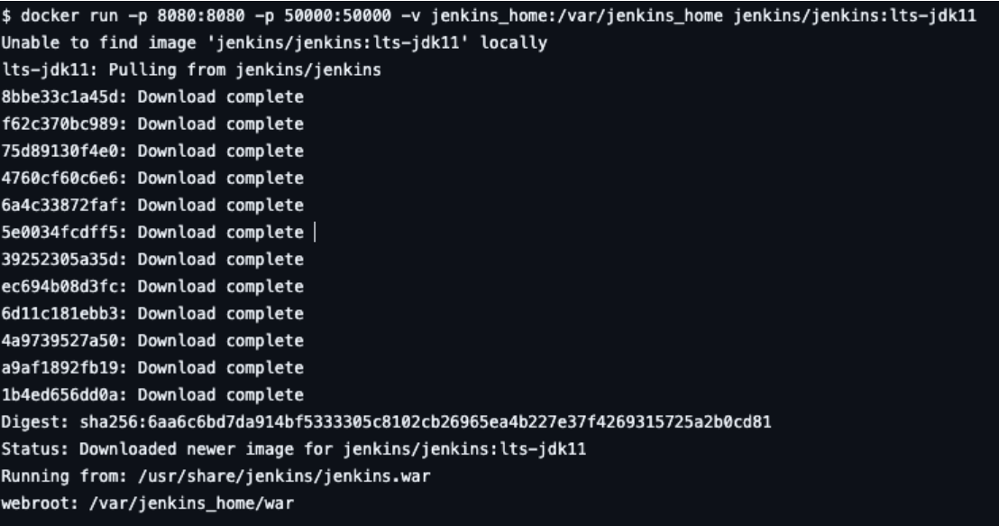

---

After the container starts, the terminal output will display the initial administrator password. Use this password during the Jenkins setup process.

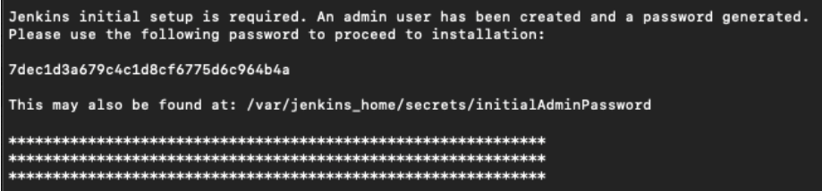

Access your web browser and log in to your Jenkins instance via: `https://localhost:8080`


# Container Access & Terraform Installation

### Step 1: Access Docker Container as Root

Once your Jenkins container is active and running, as can be seen in the terminal here:

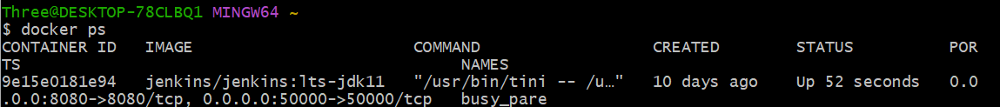

Start an interactive shell session inside the container as the `root` user.

`winpty docker exec -it --user root 9e15e0181e94 bash`

This command uses `winpty` (commonly required on Windows) to initiate a bash shell in the container with ID `9e15e0181e94`.

---

### Step 2: Create a Directory for Terraform Binary

`mkdir -p /home/jenkins/bin`

This creates the directory `/home/jenkins/bin` where the Terraform binary will be downloaded. The `-p` option ensures the parent directories are created if they don't exist.

---

### Step 3: Download the Terraform ZIP Archive

`curl -fsSL https://releases.hashicorp.com/terraform/1.5.7/terraform_1.5.7_linux_amd64.zip -o /home/jenkins/terraform.zip`

This command uses `curl` to download the Terraform ZIP archive (version 1.5.7) directly to `/home/jenkins/terraform.zip`. The `-fsSL` flags ensure a quiet download without errors and handle redirects.

---

### Step 4: Unzip the Terraform Archive

`unzip /home/jenkins/terraform.zip -d /home/jenkins/bin`

This command extracts the contents of `terraform.zip` into the `/home/jenkins/bin` directory. After unzipping, the Terraform binary will be placed in that directory.

---

### Step 5: Remove the ZIP Archive

`rm /home/jenkins/terraform.zip`

This command removes the `terraform.zip` file after extraction, cleaning up unnecessary files.

---

### Step 6: Add Terraform to the System PATH

`export PATH="/home/jenkins/bin:$PATH"`

This command adds `/home/jenkins/bin` to the `PATH` environment variable, making the Terraform binary accessible from anywhere in the shell.

---

### Step 7: Move Terraform to `/usr/local/bin`

`mv /home/jenkins/bin/terraform /usr/local/bin`

This command moves the `terraform` binary from `/home/jenkins/bin` to `/usr/local/bin`, a standard directory for system-wide binaries, making it globally accessible for all users.

---

### Step 8: Verify Terraform Installation

`terraform --version`

This command verifies the installation of Terraform by printing the installed version. In this case, it outputs version `1.5.7`, but also alerts that a newer version (1.10.5) is available for update.


# Install AWS CLI on Your Jenkins Image

## Step 1: Install AWS CLI

To install the AWS CLI (Command Line Interface) on your Jenkins container, use `apt`, the default package manager for Debian-based systems.

Run the following command:

`apt update && apt install -y awscli`

This command:
1. Updates the package index (`apt update`).
2. Installs AWS CLI (`apt install -y awscli`).

---

## Step 2: Create an AWS IAM User and Retrieve Credentials

Before adding AWS credentials to Jenkins, you need to create an AWS IAM user with the appropriate permissions and retrieve its credentials.

1. **Create an AWS IAM User**  
   - Go to the [IAM Console](https://console.aws.amazon.com/iam).
   - Click **Users** > **Add user**.
   - Enter a **User name** and select **Programmatic access**.
   - Attach necessary permissions or use **Attach policies directly** to grant permissions (e.g., `AdministratorAccess` for full access).

2. **Retrieve the AWS IAM Credentials**  
   - After creating the IAM user, you'll be provided with the `Access Key ID` and `Secret Access Key`.
   - Copy these credentials and **store them securely** in a text file (e.g., Notepad) on your local machine.  
   **Important**: Do **not** share or store these keys insecurely.

---

## Step 3: Add AWS Credentials to Jenkins

Now that you have the AWS IAM credentials, you can add them to Jenkins for AWS service access.

1. In Jenkins, click on `Manage Jenkins` 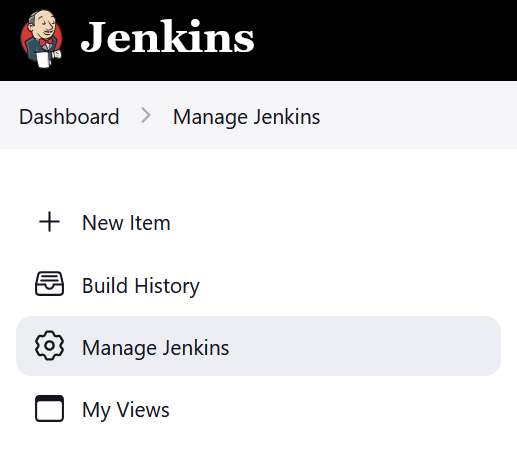.
2. Navigate to `Credentials` 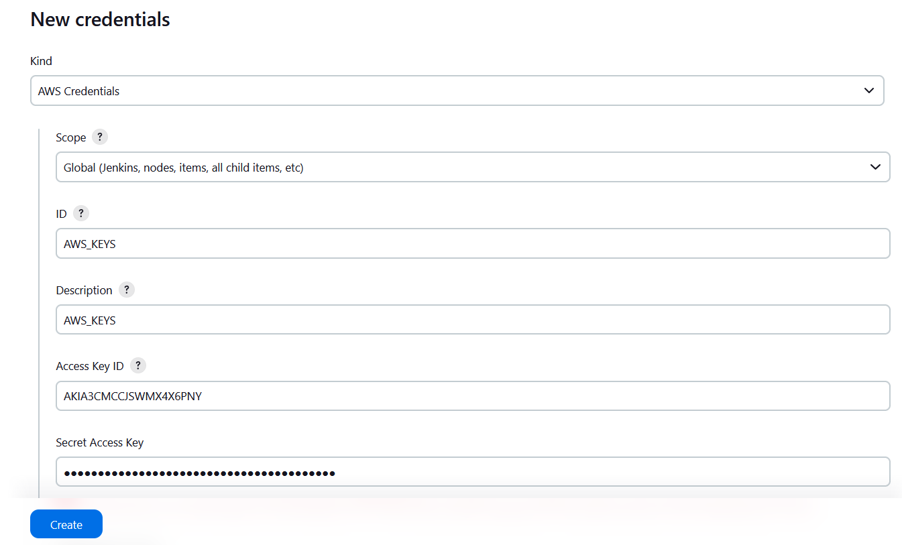.
3. Select `Global Credentials`  
   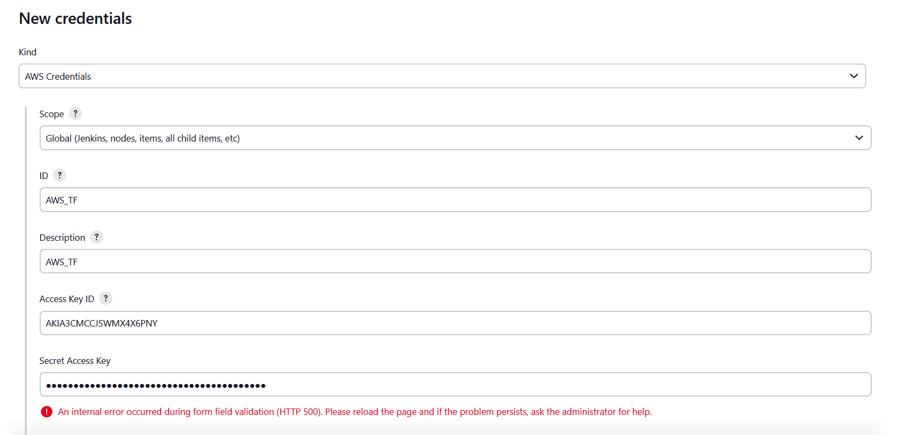  
   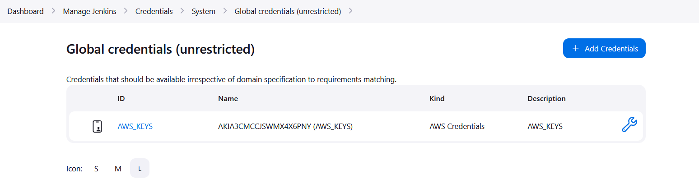  
   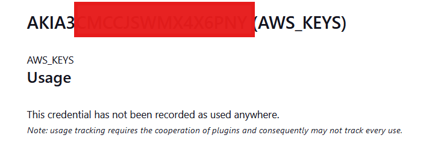  
   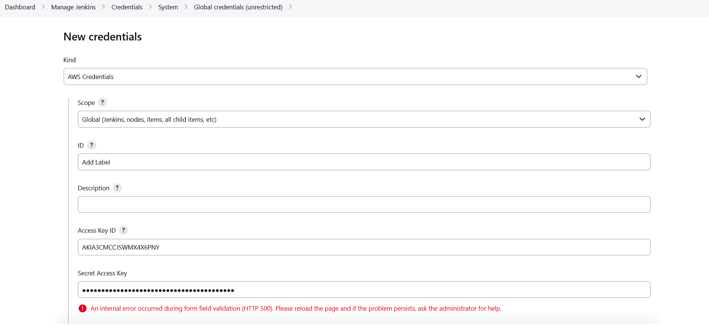.
4. Click `Create New Credentials`.
5. In the credentials form:
   - **ID field**: Provide a label.
   - **AWS Access Key ID**: Paste the copied `Access Key ID`.
   - **AWS Secret Key**: Paste the copied `Secret Access Key`.
6. Click `Create`.

After completing these steps, Jenkins will have the necessary AWS credentials configured for interacting with AWS services.


# Step 5: Create a New Pipeline
Go back to the Jenkins Dashboard  
Click **New Item**  
Enter a **Pipeline Name**  
Select **Pipeline** and click **OK**

You will be taken to the Pipeline Configuration Screen  
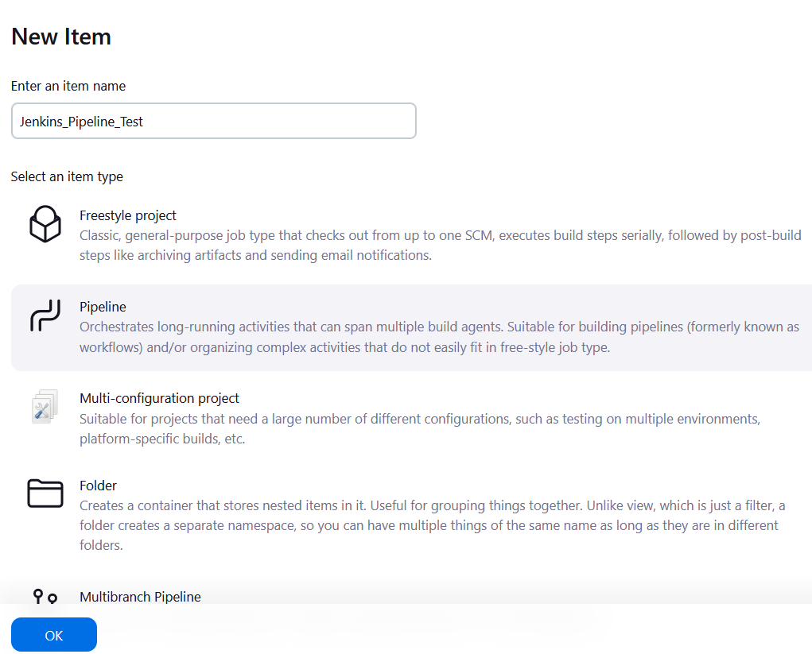

# Step 6: Configure the Pipeline
Under **General**, scroll down to the **Pipeline** section  
Change **Definition** to **Pipeline from SCM**  
Under **SCM**, choose **Git**  
Click **Save**

Enter GitHub repository URL  
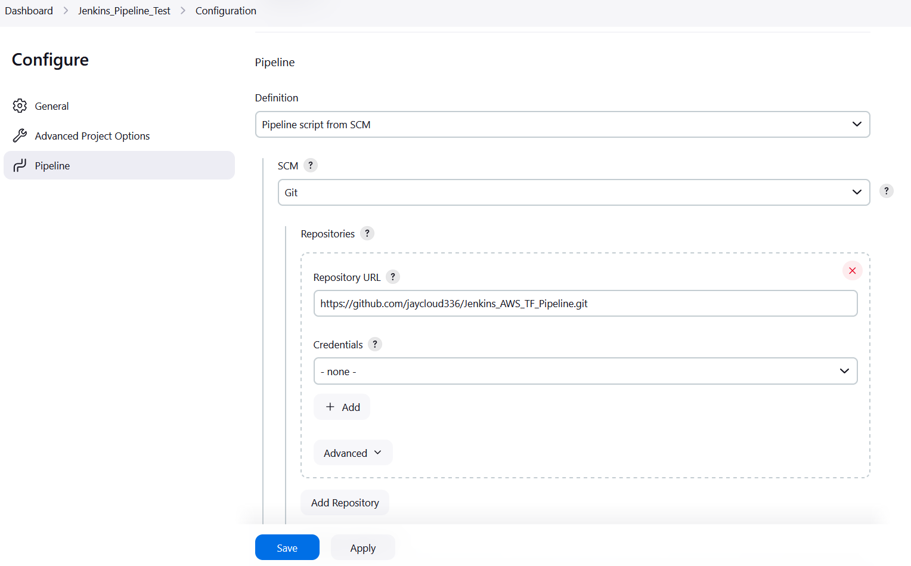

# Step 7: Access Your IDE & make edits

(Typically VSCode)
Edit your **Jenkinsfile** to reflect your Jenkins credential naming convention

These specific lines of code will need adjusting in order to match your current configuration:

- Change **Line 11**  
  `credentialsId: 'AWS_SECRET_ACCESS_KEY'`  
  To: `<your environmental variable name>`

- Change **Line 36**  
  `credentialsId: 'AWS_SECRET_ACCESS_KEY'`  
  To: `<your environmental variable name>`

- Change **Line 51**  
  `credentialsId: 'AWS_SECRET_ACCESS_KEY'`  
  To: `<your environmental variable name>`

Example:  
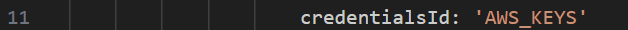

- Change **Line 22**  
  `git branch: 'main', url: 'https://github.com/<replace_with_your_repo>'`  
  To:  
  `git branch: 'main', url: 'https://github.com/jaycloud336/Jenkins_AWS_TF_Pipeline'`

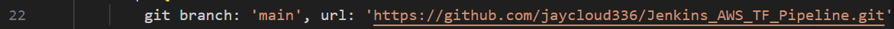


# Build Process in Jenkins  

This section outlines the actual build process within the Jenkins instance, using the Jenkins GUI to create, run, and monitor builds.  

### Steps:  

1. **Create Build**  
   - In the Jenkins dashboard, click **"New Item"**.  
   - Select **"Freestyle project"** or **"Pipeline"**, name it, and click **"OK"**.  
   - Configure the source repository under **"Source Code Management"**.  

2. **Run Build**  
   - Navigate to the job and click **"Build Now"**.  
   - The build will be queued and start execution.  

3. **Monitor Output**  
   - Click on the running build under **"Build History"**.  
   - Open **"Console Output"** to track progress and debug errors.  
   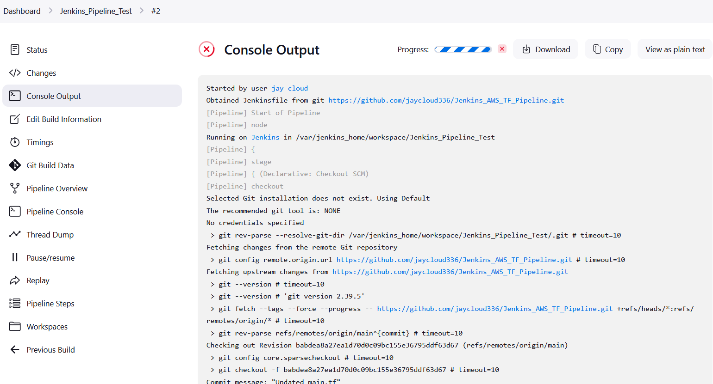

4. **Artifact Handling**  
   - Configure **"Post-build Actions"** to archive artifacts or deploy the build.  
   - Download artifacts from the **"Workspace"** or integrate with deployment tools.  

This structured process ensures efficient build execution and troubleshooting within the Jenkins GUI.  

---

At the end of the initial Build Phase, you will be asked the following:

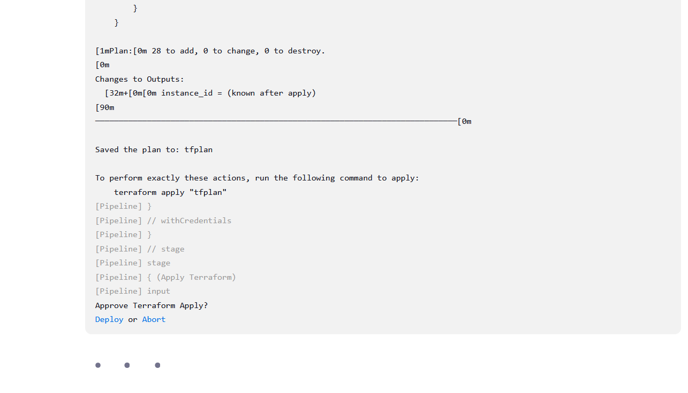

Your Jenkins pipeline has reached the stage where it requires manual approval to proceed with the Terraform apply. This is a common setup in CI/CD pipelines, especially when you want to have a chance to review the planned changes before actually deploying them.

The input step in Jenkins prompts for manual intervention to either approve or abort the Terraform apply operation.

### Here's what you can do:
- **Approve the Terraform Apply**:  
  If you want to proceed with applying the changes, click **Deploy** or provide the appropriate response in the Jenkins interface to approve the action.
  
- **Abort the Terraform Apply**:  
  If you want to stop the apply process, click **Abort** or provide the appropriate response in the Jenkins interface to cancel the deployment.

Once the input is handled, the pipeline will continue based on the decision you make:

- If you approve (**Deploy**), Jenkins will run the `terraform apply "tfplan"` command to apply the planned changes to your infrastructure.
- If you abort, the pipeline will halt at this stage without applying the changes.

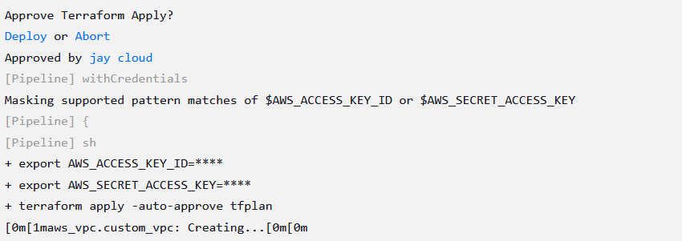

---

## Successful Build

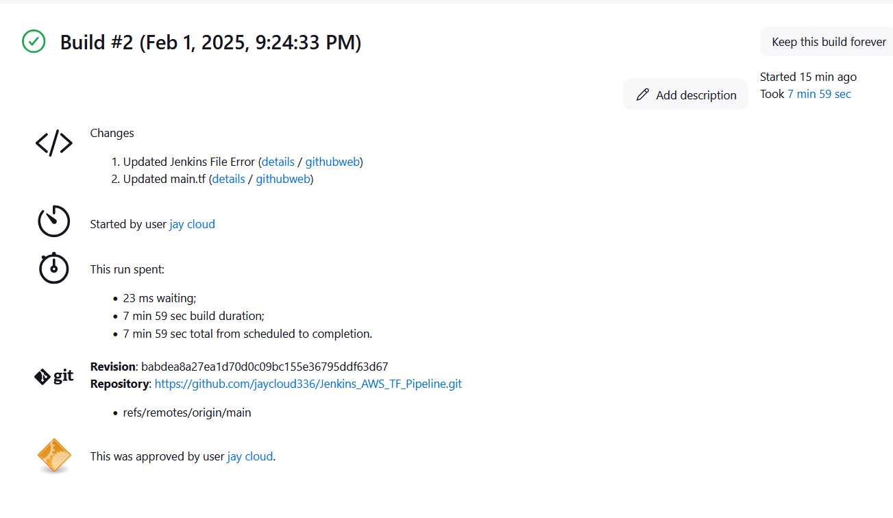

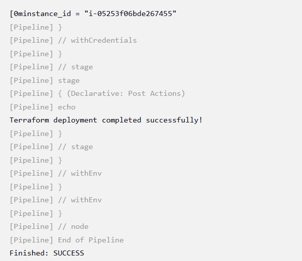

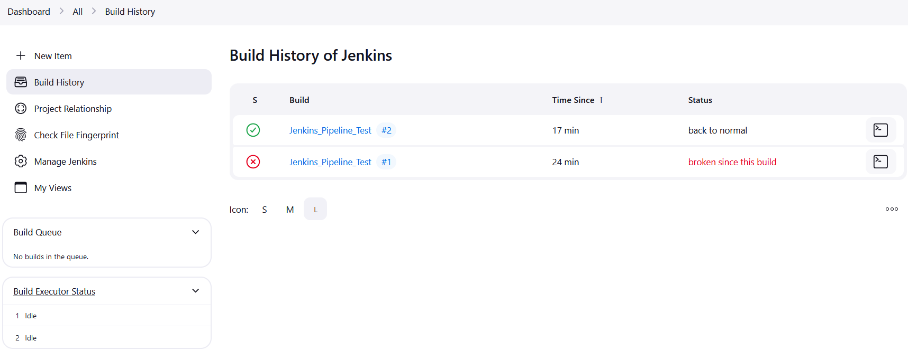

## Resources Deployed


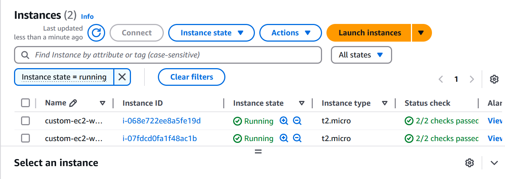

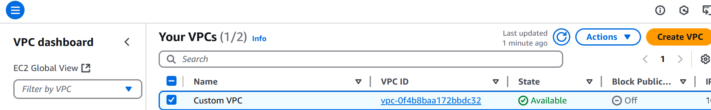

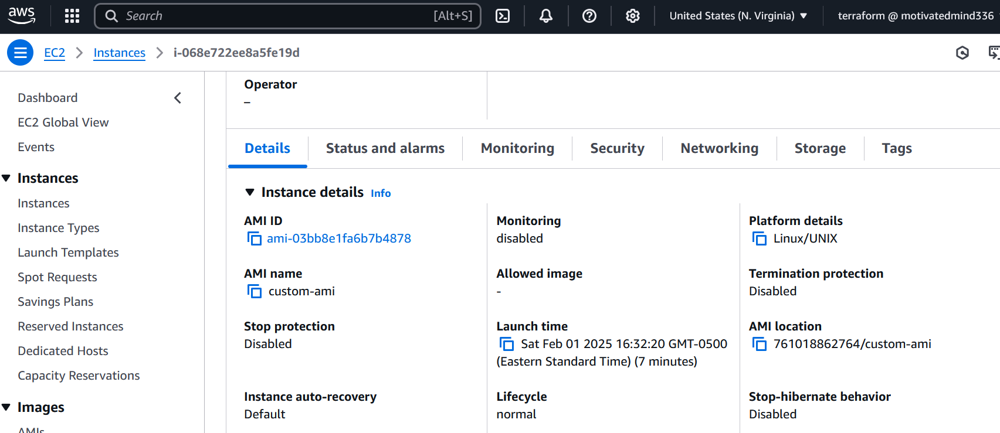


# Teardown Resources Deployed by Jenkins Using Terraform

## 1. SSH into Your Container
Log into your Jenkins container using SSH or `docker exec`:

`docker exec -it <CONTAINER_ID_OR_NAME> bash`

Replace `<CONTAINER_ID_OR_NAME>` with the actual container ID or name.

## 2. Navigate to the Jenkins Pipeline Directory
Navigate to the directory where your Jenkins pipeline workspace is located:

`cd /var/jenkins_home/workspace/<PIPELINENAME>`

Replace `<PIPELINENAME>` with the name of your Jenkins pipeline.

## 3. Set AWS Credentials in the CLI
Set your AWS credentials in the environment:

`export AWS_ACCESS_KEY_ID="<your access key>"`

`export AWS_SECRET_ACCESS_KEY="<your access key>"`

`export AWS_REGION="us-east-1"`  # Replace with your region

Replace `AWS_ACCESS_KEY_ID`, `AWS_SECRET_ACCESS_KEY`, and `AWS_REGION` with your actual values.

## Sucessful Build


## 4. Run Terraform Destroy
Run the Terraform destroy command to tear down the resources:

`terraform destroy -auto-approve`

This command will destroy the infrastructure created by Terraform without requiring confirmation.

---

**Note:** Always verify the resources Terraform will destroy and ensure the credentials are stored securely.

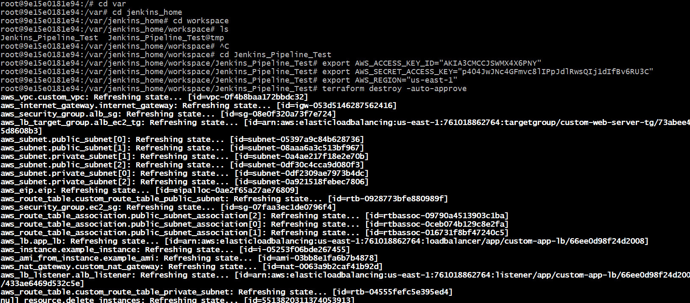

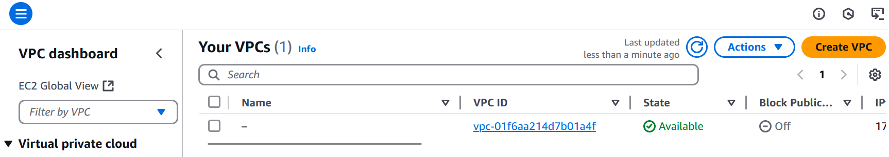

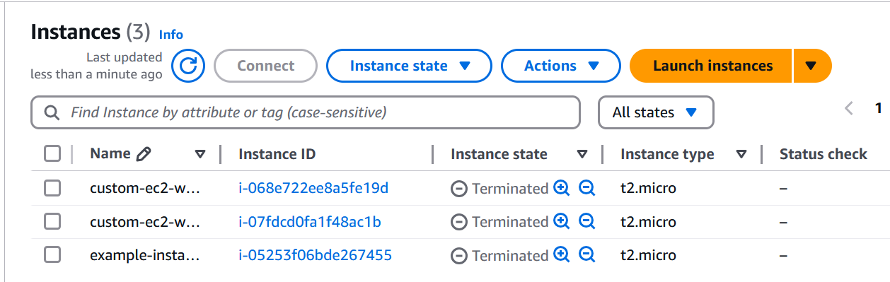