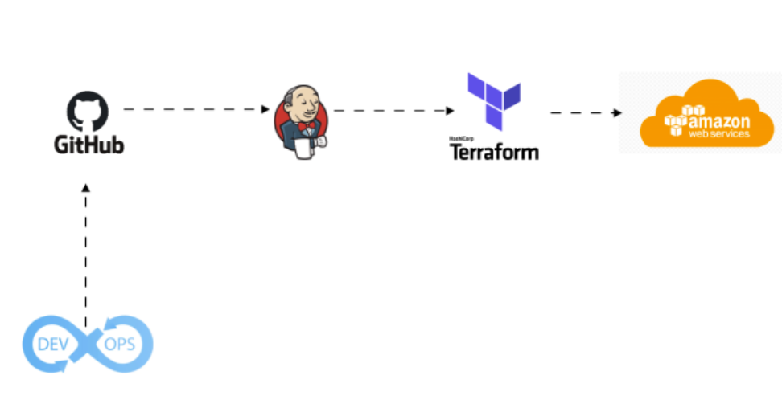

# Overview of Jenkins Pipeline with Terraform + AWS

In modern DevOps practices, continuous integration and continuous deployment (CI/CD) are crucial to streamline development workflows and enhance collaboration between teams. A Jenkins pipeline is a powerful tool in this process, automating the tasks required to build, test, and deploy applications or infrastructure changes.

This guide focuses on integrating Jenkins with Terraform and AWS, which is a common and highly effective combination in DevOps environments. Jenkins is a widely-used automation server that supports pipelines for automating various tasks, while Terraform is an infrastructure-as-code (IaC) tool that allows you to manage your cloud infrastructure efficiently and reproducibly. AWS provides the cloud services that Terraform manages, and combining all three allows for end-to-end automation in your deployment process.

## Why is this important in DevOps?

In DevOps, Jenkins pipelines are essential for automating repetitive tasks like code checkout, running Terraform plan and apply, and deploying infrastructure to AWS. By automating these processes, Jenkins reduces the need for manual intervention, speeding up deployments and making the process more reliable. Additionally, using Terraform to define infrastructure as code ensures that your infrastructure is deployed consistently and reproducibly, preventing configuration drift and minimizing human error. As your infrastructure grows, Jenkins pipelines can easily scale to accommodate new resources and environments, making them adaptable for any project. Moreover, these pipelines foster collaboration between development, operations, and infrastructure teams, who can contribute to a shared workflow, improving the overall efficiency of the process. Finally, by automating the entire deployment pipeline, Jenkins provides teams with faster feedback and quicker release cycles, leading to more reliable and timely software delivery.

---

*Setting up Jenkins pipelines with Terraform and AWS is an essential practice for teams embracing DevOps principles. It helps streamline processes, improves collaboration, and increases the overall speed and reliability of deployments. This guide will walk you through the process of setting up your Jenkins pipeline to automate the deployment of Terraform code on AWS, ensuring a smooth and efficient CI/CD pipeline.*
