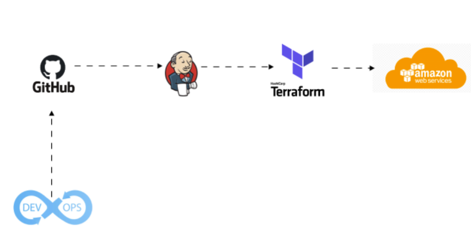

# Dockerized Jenkins Setup

<p align="center">
  
</p>

This included guide walks through the process of setting up Docker, accessing the Jenkins container, installing Terraform, and integrating AWS CLI within the Jenkins environment. It provides step-by-step instructions for pulling and running the Jenkins Docker image, installing and verifying Terraform, and configuring AWS CLI for use within the container.

In addition, it includes instructions for setting up Jenkins pipelines, integrating AWS credentials, and running Terraform commands to deploy or destroy infrastructure. By following these steps, novice users will be able to configure their Jenkins instance, automate infrastructure provisioning, and manage AWS resources effectively through Terraform.

The repository provides a Dockerized Jenkins setup for continuous integration and deployment on **Windows 11 with Docker Desktop installed**. The commands are intended for the **Bash shell**, and **`winpty` may be required** for certain commands when running in Git Bash. To get started, ensure Docker is installed and running, then pull the Jenkins LTS image using:

```bash
docker pull jenkins/jenkins:lts
```

Run the container with:

```bash
docker run -d -p 8080:8080 -p 50000:50000 jenkins/jenkins:lts
```

Retrieve the initial admin password using:

```bash
docker logs <container_id>
```

Access the Jenkins UI at **http://localhost:8080** and complete the setup. To install Terraform inside the Jenkins container, enter the container as root using:

```bash
winpty docker exec -it --user root <container_id> bash
```

Then, download and configure Terraform inside the container. This setup provides a streamlined CI/CD workflow for automating deployments and managing infrastructure.

Happy Devoping!

